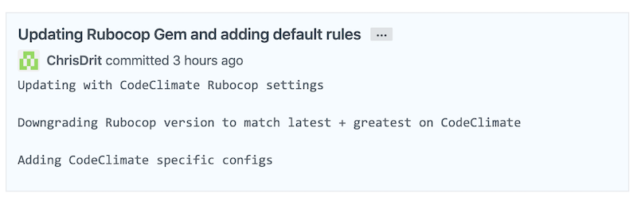

##### by Chris Dritsas
# Appointment Scheduler

### Overview

This was a take-home interview project for a company. It was **timboxed to 4 hours**.
I have since extended it. 

* **Ask:**

     * _"Prototype a web application for scheduling an appointment"_

* **Input:**

   *  _"Given a [CSV dataset](./lib/tasks/coaches.csv) that contains the active coaches and their 
     weekly schedule of their available hours, Output the following
     User Stories:"_
         
* **Output:**
        
    * _As a User, I want to see which coaches I can schedule with._
    
    * _As a User, I want to see what 30 minute timeslots are available to schedule with a particular coach._
    
    * _As a User, I want to book an appointment with a coach at one of their available times._
               
* **Anit-Requirements:**

     * _You can't do it all. We respect your time, and expect that you will have to make 
        choices and tradeoffs for what is in scope for your deliverable._
     
     * _Don't worry about authentication. Assume a non-authenticated experience to keep things simple._
     
     * _Pick your stack. Choose any libraries that help you produce the highest quality work in the time available._
    

### Stack

* [Ruby 2.6.3](https://github.com/ChrisDrit/appointment-scheduler/blob/master/Gemfile#L6) (Upgraded from [Ruby 2.5.0](https://github.com/ChrisDrit/appointment-scheduler/pull/8))
* [Rails 6.0.0](https://github.com/ChrisDrit/appointment-scheduler/blob/master/Gemfile#L9) (Upgraded from [Rails 5.2.1](https://github.com/ChrisDrit/appointment-scheduler/pull/9))
* [Bootstrap](https://github.com/ChrisDrit/appointment-scheduler/blob/master/app/views/layouts/application.html.erb#L10) for Responsive layouts (mobile first!)

### Heroku

* [Rails Appointment Scheduler](https://rails-appointment-scheduler.herokuapp.com/)
* This is on a free `Hobby` tier so your millage may very.

### Pull Requests

I've setup this up, and am developing as I would in a normal Dev environment with other engineers. 

This is a public repo (open source) so feel free to push a new branch and create
a Pull Request for me with any questions!

* I have been pushing branches and creating [PR's on Github](https://github.com/ChrisDrit/appointment-scheduler/pulls?q=is%3Apr+is%3Aclosed) (ready for code review):

    

* I have added a couple helpful integrations - CodeClime (Rubocop) and CircleCI (Rspec's):

    

* Making use of inline Todo comments while working through the feature to show progress:

    

* Rebasing my git commits (`git rebase -i origin/master`) for better clairity in the Git logs:

    

### Local Setup

* `bundle install`
* `bundle exec rails db:setup`
* `bundle exec rails import:all_data:from_csv`

### Run RSpec's

* `bundle exec rspec`
* `bundle exec rspec -f d --tag ~skip` (to skip pending tests)
     
    

### Run Rubcop

* `bundle exec rubocop`

### Run App Locally

* `bundle exec rails s`
* `http://localhost:3000/`

### App Screenshots

* **Mobile Ready (Responsive)**

    

* **Schedule a coaches time**

 

---

